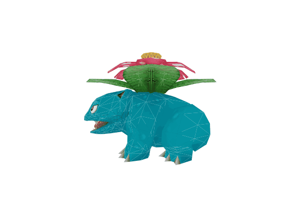
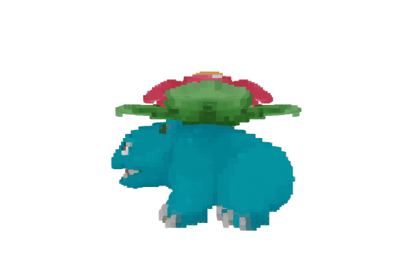

# voxelify
[ ](https://codeship.com/projects/164726)

This project can be used to transform a 3D model (OBJ file) into voxel information (3D pixels).

It will be reused in my web interface project "beads3d".

## Idea
```
> npm install -g voxelify
... installs voxelify globally

> voxelify model.obj --size 20 --output result.png
... creates a 20 x 400 PNG image (20 layers with 20 x 20 pixels)
```

## Example

| Original          | Voxels (size = 50)  |
| ----------------- | ------------------- |
|  |  |


## TODO
* [x] read OBJ mesh with textures
* [x] render scene
* [x] visit triangles
* [x] voxelify triangle
...
* [ ] voxel preview to PNG/GIF
* [ ] documentation (code + usage)

## Nice-to-have
* [ ] import THREE.js client libraries [via `vm` package](http://stackoverflow.com/questions/5171213/load-vanilla-javascript-libraries-into-node-js)
* [x] render camera animation as GIF file
* [ ] use Javascript `standard` package

## License

[MIT](LICENSE.md)
