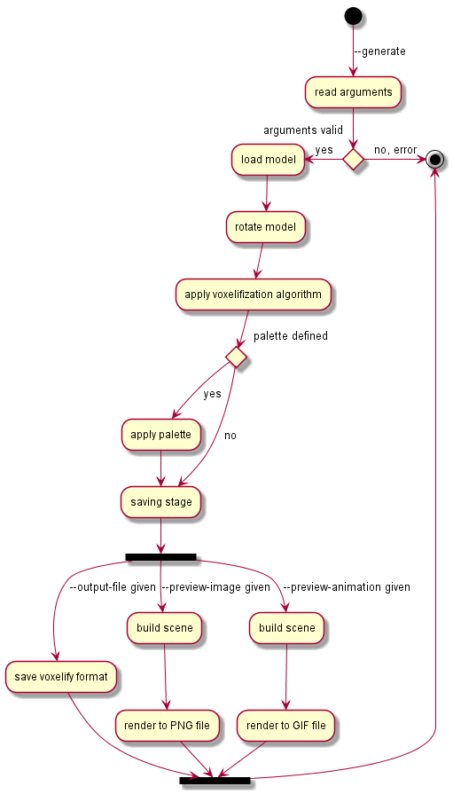

# Commands

## Generate from 3D model

* Status: analysis
* Priority: core feature

```
> voxelify
    --generate
    --input-file model.obj
    --size 20
    [--output-file model.json]
    [--yaw 90]
    [--pitch 20]
    [--roll 10]
    [--palette palette.json]
    [--preview-image preview.png]
    [--preview-animation preview.gif]
    [--preview-width 600]
    [--preview-height 400]
    [--force]
    [--progress]

creating model.json + model.map.png
```

Mode arguments:
* `--generate`, required, the current tool mode

Input arguments:
* `--input-file <model.obj>`, required, the input model path
  * currently only OBJ file format supported!
* `--size <int>`, required, the maximal width/depth/height of the model in units
* `--yaw <float>`, optional, euler rotation in degrees for the model, defaults to 0
* `--pitch <float>`, optional, euler rotation in degrees for the model, defaults to 0
* `--roll <float>`, optional, euler rotation in degrees for the model, defaults to 0
* `--palette <palette.json>`, optional, path to palette. Only colors of this palette will be used.

Output arguments:
* `--progress`, optional, show progress via standard error stream `stderr`
* `--force`, optional, will overwrite existing files
* `--preview-width <int>`, required `--preview-image` and `--preview-animation`, the actual output width
* `--preview-height <int>`, required `--preview-image` and `--preview-animation`, the actual output height
* at least one must be set:
  * aborts if files already exist, see `--force`
  * `--output-file <model.json>`, optional, the target file path for voxelified model
    * a `model.map.png` with packed color information will also be generated
  * `--preview-image <preview.png>`, optional, the target path for saving a preview image
  * `--preview-animation <preview.gif>`, optional, the target path for saving a preview animation

### Flow

Actions:
* read arguments
* validate arguments
* load model
* rotate model
* [voxelify model](ALGORITHM.md)
* apply palette
* render scene to PNG file
* render scene to GIF file
* save to voxelify format



## Initialize palette

* Status: idea
* Priority: middle

```
> voxelify --palette --output-file palette.json

creating palette.json
```

## Export voxel model

* Status: idea
* Priority: low

```
> voxelify
  --export
  --input-file model.json
  --output-file xyz.abc
  --format (3D|pdf|image)
```
