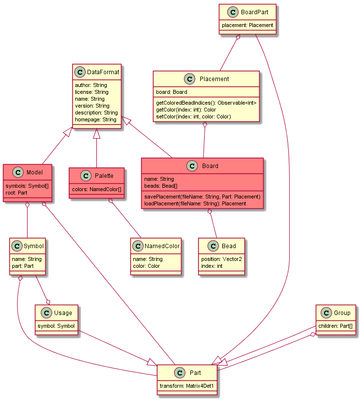

# Formats



## Model

### 2D model
```json
{
  "format": "flat-v1.0.0",
  "spriteId": 0
}
```

Fields:
* `format` = "flat-v1.0.0"
* `spriteId`: sprite id

### 3D grid model
```json
{
  "format": "grid-v1.0.0",
  "layers": [
    {
      "spriteId": 123,
      "targetX": 0,
      "targetY": 2
    },
    null
  ]
}
```

Fields:
* `format` = "grid-v1.0.0"
* `layers`: list of layers (**required**), bottom-up, where each item can be `null` for an empty layer, or an object with following fields
  * `spriteId`: Integer source spriteId (**required**)
  * point where to place the colors on this layer (**optional**)
    * `targetX`: Integer (**optional**, default is 0)
    * `targetY`: Integer (**optional**, default is 0)

### 3D assembled model

#### Example

```json
{
  "format": "assembled-v1.0.0",
  "definitions": {
    "side": {
      "type": "data",
      "spriteId": 456,
      "centerX": 3,
      "centerY": 4,
      "translation": {
        "x": 1,
        "y": 2,
        "z": 10
      },
      "rotation": {
        "type": "euler",
        "order": "xyz",
        "x": 90,
        "y": 0,
        "z": 0
      }
    }
  },
  "children": [
    {
      "type": "use",
      "reference": "side",
      "rotation": {
        "type": "quaternion",
        "w": 1,
        "x": 0,
        "y": 0,
        "z": 0
      }
    }, {
      "type": "group",
      "children": []
    }
  ]
}
```

#### Classes

Model
* `format` = "assembled-v1.0.0"
* `definitions`: map of String => `Part`
* `children`: list of `Part`

*Part* (abstract class)
* `type`: (`use`|`data`|`group`)
* `translation`: `Vector3`, defaults to (0, 0, 0)
* `rotation`: `Rotation`, defaults to `Quaternion(1, 0, 0, 0)`
* rotation will be applied at the translated location

Data (extends *Part*)
* `spriteId`: int, sprite id
* `centerX`: int
* `centerY`: int

Use (extends *Part*)
* `reference`: String, a valid definition name

Group (extends *Part*)
* `children`: list of `Part`

Vector3
* `x`: Number
* `y`: Number
* `z`: Number

*Rotation*
* `type` = ('euler'|`quaternion`)

Euler (extends `Rotation`)
* `type` = "euler"
* `order`: permutation string of `x`, `y`, `z`
* `x`: Number
* `y`: Number
* `z`: Number

Quaternion (extends `Rotation`)
* `type` = "quaternion"
* `w`: Number
* `x`: Number
* `y`: Number
* `z`: Number

## Palettes
```json
{
  "C21": "#FF0000",
  "C22": "#00FF00",
  "C23": "#0000FF",
  "C24": {
    "name": "Red",
    "color": "#FF0000"
  }
}
```

It is a map of identifiers to color values or an object with following fields:
* `name`: String, a caption
* `color`: String, a hex color

## Metadata

*I think such data is not needed. You need it online for a repository.*

```json
{
  "name": "powerpuff",
  "type": "model",
  "description": "I am a grid!",
  "version": "1.0.0",
  "author": "Me",
  "homepage": "http://example.com",
  "license": "CC1.0",
  "main": "palette.json"
}
```

Fields:
* `main`: path to JSON file
* `name`: String, required, name of the palette/model
* `version`: semantic version, required, version of palette NOT model!
* `type`: (palette|model), required
* `license`: String, required, license of palette/model
* `description`: String, optional, description of the palette/model
* `author`: String, optional, who made this palette/model?
* `homepage`: URL, optional
